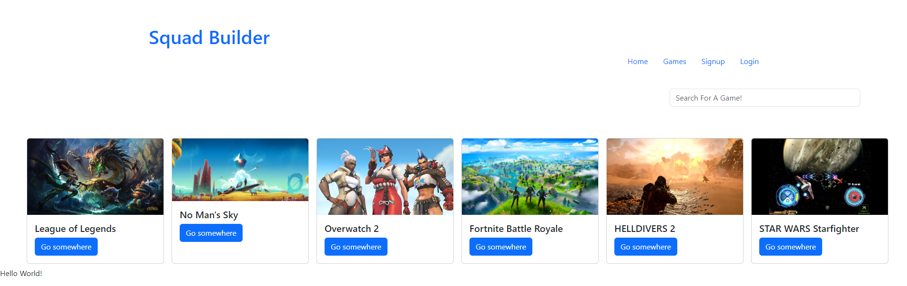

# Squad-
# Squad Builder

## Description

An app for avid gamers to uld communities centered around there favorite game.

## Table of Contents

- [Installation](#installation)
- [Usage](#usage)
- [Credits](#credits)
- [License](#license)
- [Features](#features)
- [Contributions](#contributions)
- [Tests](#tests)
- [Questions](#questions)
- [Screenshot](#screenshot)

## Installation

Please see package.json in root, client, and server folders respectively foor a list of dependencies.

## Usage

Users will need to login or signup to utilize the bulk of the site. After login, users can browse games, search for new games, and add or join squads.

## Credits

My instructor Leif and my buddy Thomas.

## License

This project uses the [MIT](https://choosealicense.com/licenses/mit/) License.

---

## Features

React annd various plugins and add ons.

## Contributions

N/A 

Also see [Contributor Covenant](https://www.contributor-covenant.org/).

## Tests

N/A

## Questions

If you have any questions or concerns reach out to me via one of the following: 

GitHub: [https://github.com/xWhoKnowz](https://github.com/xWhoKnowz) 
Email: jeremiah2498@gmail.com

## Webpage Screenshot
    

